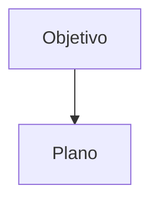

@@ Planejamento da auditoria

## Estratégia

Definir o objetivo e a sequência de trabalho.

### Fluxo

```mermaid
flowchart TD
  A[Objetivo] --> B[Plano]
```

> **Atenção:** registrar a estratégia antes do plano.
