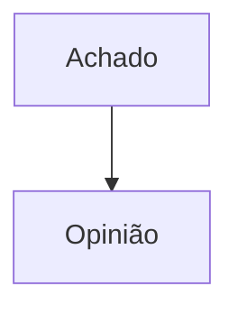

@@ Relatório de auditoria

## Opinião

| Tipo | Base |
| --- | --- |
| Limpa | Evidência suficiente |

### Decisão

```mermaid
flowchart TD
  A[Achado] --> B[Opinião]
```

> **Ordem:** opinião antes da base.
