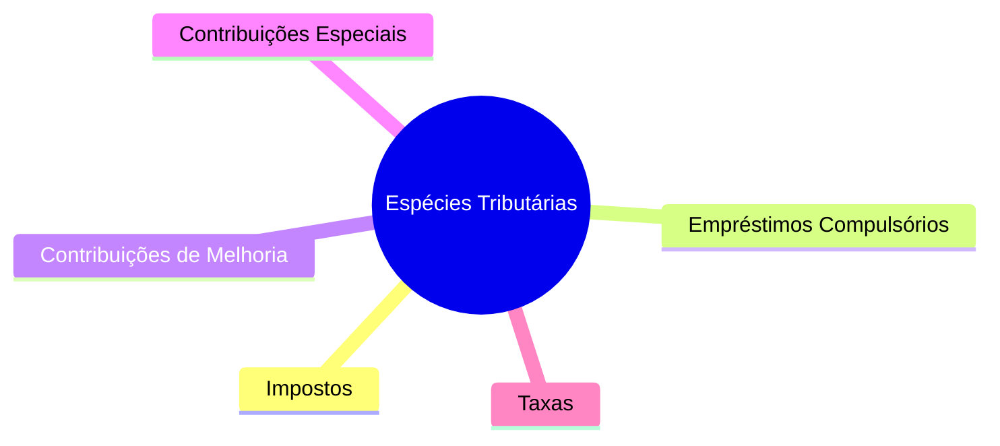

@@@
## NATUREZA JURÍDICA DO TRIBUTO

A **natureza jurídica específica de um tributo** é determinada, primordialmente, pelo seu **fato gerador (FG)**. Conforme o **Art. 4º do Código Tributário Nacional (CTN)**, são considerados **irrelevantes** para essa definição:

1.  A **denominação** e outras características formais que o tributo possa apresentar.
2.  A **destinação** legal da receita arrecadada.

> **FLASHCARD (LETRA DA LEI - CTN)**
>
> **Art. 4º, CTN:** A natureza jurídica específica do tributo é determinada pelo fato gerador da respectiva obrigação, sendo irrelevantes para qualificá-la:
> I - a denominação e demais características formais adotadas pela lei;
> II - a destinação legal do produto da sua arrecadação.

---

> **ATENÇÃO: Impacto da Constituição Federal de 1988 (CF/88)**
>
> Com a promulgação da CF/88, a regra de irrelevância da destinação da arrecadação, prevista no Art. 4º do CTN, foi **invalidada** para certas espécies tributárias, como os **Empréstimos Compulsórios (ECs)** e as **Contribuições**.
>
> Para esses tributos, a **destinação da arrecadação** tornou-se uma **característica principal** e determinante de sua natureza.
>
> **Exemplos:**
> *   A **Contribuição Social sobre o Lucro Líquido (CSLL)**, embora possua um fato gerador similar ao Imposto de Renda Pessoa Jurídica (IRPJ), é uma contribuição social por ter sua arrecadação **destinada à seguridade social**.
> *   A **Contribuição para o Financiamento da Seguridade Social (COFINS)** também tem sua arrecadação vinculada à seguridade social.

> **FLASHCARD (Certo/Errado - CEBRASPE)**
>
> A destinação da receita arrecadada é sempre irrelevante para a determinação da natureza jurídica de qualquer tributo, conforme o Art. 4º do CTN.
> **[ERRADO]**
> *Justificativa:* Embora o Art. 4º do CTN estabeleça a irrelevância da destinação, a CF/88 alterou esse entendimento para Empréstimos Compulsórios e Contribuições, para os quais a destinação da arrecadação é uma característica fundamental.

---

@@@
## ESPÉCIES TRIBUTÁRIAS

O sistema tributário brasileiro classifica os tributos em diferentes espécies, cada uma com características e fatos geradores específicos. A seguir, são detalhadas as principais espécies tributárias.



---

@@@
## IMPOSTOS

Os **impostos** são tributos de competência da União, Estados, Distrito Federal e Municípios. Sua principal característica é a **não vinculação** a uma atividade estatal específica.

*   **Fato Gerador (FG):** Conforme o **Art. 16 do CTN**, a obrigação tributária de um imposto tem como fato gerador uma situação **independente de qualquer atividade estatal específica** relativa ao contribuinte.
*   **Finalidade:** Os impostos visam financiar as **atividades gerais do Estado** (conhecidas como *uti universi*), ou seja, serviços públicos que beneficiam a coletividade de forma indistinta, sem uma contraprestação direta e individualizada.

> **FLASHCARD (LETRA DA LEI - CTN)**
>
> **Art. 16, CTN:** Imposto é o tributo cuja obrigação tem por fato gerador uma situação independente de qualquer atividade estatal específica, relativa ao contribuinte.

---

> **Exceção à Regra da Não Vinculação:**
>
> Embora a regra geral seja a não vinculação da receita de impostos, a própria Constituição Federal prevê **excepcionalmente** a possibilidade de vinculação para determinadas finalidades, como:
> *   **Saúde**
> *   **Ensino**
> *   **Atividades da Administração Tributária**
>
> Essa exceção está prevista no **Art. 167, inciso IV, da CF**.

> **PEGADINHA DE PROVA:**
>
> A regra da não vinculação da receita de impostos é absoluta no direito tributário brasileiro.
> **[ERRADO]**
> *Justificativa:* Existem exceções constitucionais à regra da não vinculação, como a destinação de recursos para saúde, ensino e atividades da administração tributária.

---

@@@
## EMPRÉSTIMOS COMPULSÓRIOS

Os **empréstimos compulsórios** são tributos de competência **exclusiva da União**, instituídos por meio de **Lei Complementar (LC)**. Eles se caracterizam pela **vinculação obrigatória** da arrecadação à despesa que fundamentou sua criação e pela necessidade de **resgate** dos valores.

> **FLASHCARD (LETRA DA LEI - CF)**
>
> **Art. 148, CF:** A União, mediante lei complementar, poderá instituir empréstimos compulsórios:
> I - para atender a despesas extraordinárias, decorrentes de calamidade pública, de guerra externa ou sua iminência;
> II - no caso de investimento público de caráter urgente e de relevante interesse nacional.
> Parágrafo único. A aplicação dos recursos provenientes de empréstimo compulsório será vinculada à despesa que fundamentou sua instituição.

---

Existem duas hipóteses para a instituição de empréstimos compulsórios, com regras distintas, especialmente quanto ao princípio da anterioridade:

### Hipóteses de Instituição e Regras de Anterioridade

| Característica              | Hipótese I: Despesas Extraordinárias (Art. 148, I, CF)                                 | Hipótese II: Investimento Público Urgente (Art. 148, II, CF)                                |
| :-------------------------- | :-------------------------------------------------------------------------------------- | :------------------------------------------------------------------------------------------ |
| **Motivo**                  | Calamidade pública, guerra externa ou sua iminência.                                    | Investimento público de caráter urgente e relevante interesse nacional.                     |
| **Anterioridade**           | **NÃO observa** nenhuma anterioridade (nem anual, nem noventena).                      | Observa a **anterioridade anual** (exercício financeiro seguinte) e a **noventena** (90 dias). |
| **Exemplo**                 | Financiamento de ações emergenciais após grandes desastres naturais.                    | Construção de infraestrutura estratégica para o país.                                       |

---

### Vinculação e Resgate

*   **Vinculação dos Recursos:** A aplicação dos recursos arrecadados com o empréstimo compulsório é **obrigatoriamente vinculada** à despesa que justificou sua instituição (Art. 148, Parágrafo único, CF).
*   **Resgate:** A lei complementar que institui o empréstimo compulsório deve **obrigatoriamente fixar o prazo e as condições de seu resgate** (Art. 15, Parágrafo único, CTN).

> **FLASHCARD (LETRA DA LEI - CTN)**
>
> **Art. 15, Parágrafo único, CTN:** A lei fixará obrigatoriamente o prazo e as condições de seu resgate.

---

@@@
## CONTRIBUIÇÕES DE MELHORIA

As **contribuições de melhoria** são tributos de competência comum da União, Estados, Distrito Federal e Municípios. Seu fato gerador está diretamente ligado à **valorização imobiliária** decorrente de uma obra pública.

> **FLASHCARD (LETRA DA LEI - CTN)**
>
> **Art. 81, CTN:** A Contribuição de Melhoria, instituída para fazer face ao custo de obras públicas de que decorra valorização imobiliária, tem como limite total a despesa realizada e como limite individual o acréscimo de valor que da obra resultar para cada imóvel beneficiado.

---

### Características Essenciais

*   **Fato Gerador (FG):** A **valorização imobiliária** de um imóvel, resultante da execução de uma **obra pública**.
*   **Instituição:** A instituição da Contribuição de Melhoria exige uma **lei específica para cada obra pública** que a justifique.
*   **Limites de Cobrança:**
    *   **Limite Total:** O valor total arrecadado com a Contribuição de Melhoria não pode exceder a **despesa total realizada** com a obra pública.
    *   **Limite Individual:** A parcela cobrada de cada contribuinte não pode ser superior ao **acréscimo de valor** que a obra trouxe para o seu imóvel.
*   **Vinculação da Arrecadação:** A arrecadação da Contribuição de Melhoria **NÃO é necessariamente vinculada** à obra que a gerou, podendo ser destinada a outras finalidades gerais do ente federativo, salvo disposição legal em contrário.
*   **Limite de Pagamento Anual:** A parcela anual a ser paga pelo contribuinte **não pode exceder 3%** do maior valor fiscal do seu imóvel.

---

> **Casos Especiais e Pegadinhas:**
>
> *   **Pavimentação NOVA:** A realização de uma pavimentação **nova** em uma rua **enseja** a cobrança de Contribuição de Melhoria, pois gera valorização imobiliária.
> *   **Recapeamento:** O simples **recapeamento** de uma via já existente, que consiste em manutenção ou melhoria da superfície, **NÃO enseja** a cobrança de Contribuição de Melhoria, pois geralmente não há valorização imobiliária significativa.

> **FLASHCARD (Certo/Errado - CEBRASPE)**
>
> O recapeamento de uma via pública é fato gerador apto a ensejar a cobrança de Contribuição de Melhoria.
> **[ERRADO]**
> *Justificativa:* O recapeamento, por ser uma obra de manutenção, geralmente não gera a valorização imobiliária necessária para a cobrança da Contribuição de Melhoria, diferentemente de uma pavimentação nova.

---

@@@
## CONTRIBUIÇÕES ESPECIAIS

As **contribuições especiais** são tributos de competência **exclusiva da União**, embora, excepcionalmente, Estados, Distrito Federal e Municípios possam instituir a Contribuição para o Custeio do Serviço de Iluminação Pública (COSIP). A principal característica dessas contribuições é a **vinculação da arrecadação** a finalidades específicas.

> **FLASHCARD (LETRA DA LEI - CF)**
>
> **Art. 149, CF:** Compete exclusivamente à União instituir contribuições sociais, de intervenção no domínio econômico e de interesse das categorias profissionais ou econômicas, como instrumento de sua atuação nas respectivas áreas, observado o disposto nos arts. 146, III, e 150, I e III, e no art. 150, VI, "a" e § 1º.

---

### Classificação das Contribuições Especiais

As Contribuições Especiais podem ser classificadas da seguinte forma:

```mermaid
mindmap
  root((Contribuições Especiais))
    Competência((Competência: União (regra), E/DF/M (exceção para COSIP)))
    Arrecadação Vinculada
    Tipos
      Contribuições Sociais
        Seguridade Social
          PIS
          COFINS
          CSLL
          Outras para Seguridade
        Residuais (instituídas por LC)
      Contribuições de Intervenção no Domínio Econômico (CIDE)
      Contribuições de Interesse das Categorias Profissionais ou Econômicas (Corporativas)
      Contribuições para o Custeio do Serviço de Iluminação Pública (COSIP)
        Competência: Municípios e Distrito Federal
```

*   **Contribuições Sociais:**
    *   **De Seguridade Social:** Destinadas ao financiamento da seguridade social (saúde, previdência e assistência social). Exemplos incluem PIS, COFINS e CSLL. São instituídas por Lei Ordinária (LO).
    *   **Outras Contribuições para a Seguridade Social:** Podem ser criadas pela União para financiar a seguridade social, desde que por Lei Complementar (LC) e observando as regras de não cumulatividade e anterioridade.
    *   **Residuais:** Contribuições sociais que a União pode instituir, desde que por Lei Complementar, para atender às necessidades da seguridade social, desde que não tenham fato gerador ou base de cálculo próprios de impostos já existentes.
*   **Contribuições de Intervenção no Domínio Econômico (CIDE):** Destinadas a regular setores específicos da economia.
*   **Contribuições de Interesse das Categorias Profissionais ou Econômicas (Corporativas):** Visam financiar entidades de classe ou conselhos profissionais. Exemplo: Contribuições para o Salário-Educação (que é uma contribuição social geral, mas o texto original a lista aqui como exemplo de "Gerais").
*   **Contribuição para o Custeio do Serviço de Iluminação Pública (COSIP):** De competência dos Municípios e do Distrito Federal, destinada exclusivamente ao custeio do serviço de iluminação pública.

---

@@@
## TAXAS

As **taxas** são tributos de competência comum da União, Estados, Distrito Federal e Municípios. Caracterizam-se por serem **tributos vinculados** ou **contraprestacionais**, ou seja, sua cobrança depende de uma atuação estatal específica e divisível em relação ao contribuinte.

> **FLASHCARD (LETRA DA LEI - CF)**
>
> **Art. 145, II, CF:** A União, os Estados, o Distrito Federal e os Municípios poderão instituir os seguintes tributos:
> II - taxas, em razão do exercício do poder de polícia ou pela utilização, efetiva ou potencial, de serviços públicos específicos e divisíveis, prestados ao contribuinte ou postos à sua disposição;

---

### Tipos de Taxas e Características

As taxas podem ser de dois tipos principais:

1.  **Taxa de Polícia:** Cobrada em razão do **exercício regular do poder de polícia**.
2.  **Taxa de Serviço:** Cobrada pela **utilização, efetiva ou potencial, de serviços públicos específicos e divisíveis**, prestados ao contribuinte ou postos à sua disposição.

**Características Gerais das Taxas:**

*   **Contraprestacional / Sinalagmático / Vinculado:** A cobrança da taxa está diretamente ligada a uma atuação estatal específica que beneficia ou afeta o contribuinte.
*   **Arrecadação:** A arrecadação das taxas **NÃO é necessariamente vinculada** a uma finalidade específica, **SALVO** em casos expressos, como a taxa de fiscalização da atividade notarial, cuja receita é vinculada.

---

### Jurisprudência Relevante sobre Taxas

*   **Competência Comum (STF RE 602.089):** Quando dois entes federativos possuem **competência comum** para fiscalizar uma mesma atividade, **ambos podem instituir taxas** de fiscalização.
*   **Distinção entre Taxa e Preço Público/Tarifa (STF Súmula 545):** Os preços de serviços públicos (tarifas) e as taxas **NÃO se confundem**. Serviços como fornecimento de energia elétrica, água e esgoto, quando prestados por concessionárias ou permissionárias, são remunerados por **tarifas** (preços públicos), e não por taxas.

---

### Fato Gerador e Base de Cálculo

O **Art. 77, § único, do CTN** estabelece importantes restrições para o fato gerador e a base de cálculo das taxas:

*   A taxa **NÃO pode ter base de cálculo ou fato gerador idênticos** aos dos impostos.
*   A taxa **NÃO pode ser calculada em função do capital social** das empresas.

> **FLASHCARD (LETRA DA LEI - CTN)**
>
> **Art. 77, § único, CTN:** A taxa não pode ter base de cálculo ou fato gerador idênticos aos que correspondam a imposto nem ser calculada em função do capital das empresas.

---

### Jurisprudência sobre Base de Cálculo das Taxas

*   **Identidade Parcial (STF Súmula Vinculante 29):** É **CONSTITUCIONAL** a adoção de um ou mais elementos da base de cálculo de um imposto para a composição da base de cálculo de uma taxa, **desde que NÃO haja identidade INTEGRAL** entre elas.
*   **Taxa Judiciária e Valor da Causa (STF Súmula 667):** A taxa judiciária calculada **SEM limite sobre o valor da causa VIOLA** a garantia de acesso à jurisdição.
    *   > **CUIDADO!** A taxa judiciária **pode ter como base de cálculo o valor da causa/condenação**, desde que haja um **limite máximo** para a cobrança (STF, AI 564.642).
*   **Monte-Mor como BC (STF ADI 2.040):** A escolha do **valor do monte-mor** (conjunto de bens deixados pelo falecido) como base de cálculo da taxa judiciária encontra **óbice no Art. 145, § 2º, da CF**. Isso ocorre porque o monte-mor, quando contém bens imóveis, já é base de cálculo do Imposto sobre Transmissão Causa Mortis e Doação (ITCMD) e do Imposto sobre Transmissão de Bens Imóveis (ITBI), configurando identidade vedada.
*   **Capacidade Contributiva (STF RE 232.393):** O Supremo Tribunal Federal entende que **nada impede que o princípio da capacidade contributiva se aplique às taxas**, permitindo que sejam "graduadas segundo a capacidade econômica" do contribuinte.
    *   > **OBSERVAÇÃO:** Algumas bancas examinadoras, como a FCC, **NÃO aceitam** esse entendimento, considerando que o princípio da capacidade contributiva é exclusivo dos impostos.

---

@@@
## TAXA DE SERVIÇO

A **taxa de serviço** é cobrada pela utilização de serviços públicos específicos e divisíveis. Para que um serviço público possa ser remunerado por taxa, ele deve atender a critérios rigorosos, conforme o **Art. 79 do CTN**:

> **FLASHCARD (LETRA DA LEI - CTN)**
>
> **Art. 79, CTN:** Os serviços públicos a que se refere o artigo 77 consideram-se:
> I - utilizados pelo contribuinte:
> a) efetivamente, quando por ele usufruídos a qualquer título;
> b) potencialmente, quando, sendo de utilização compulsória, sejam postos à sua disposição mediante atividade administrativa em efetivo funcionamento;
> II - específicos, quando possam ser destacados em unidades autônomas de intervenção, de utilidade, ou de necessidades públicas;
> III - divisíveis, quando suscetíveis de utilização, separadamente, por parte de cada um dos seus usuários.

---

### Requisitos para a Taxa de Serviço

1.  **Utilizados pelo Contribuinte:**
    *   **Efetivamente:** Quando o serviço é **usufruído** pelo contribuinte, a qualquer título.
    *   **Potencialmente:** Quando o serviço, sendo de **utilização compulsória**, é **posto à disposição** do contribuinte por meio de uma atividade administrativa em efetivo funcionamento.
2.  **Específicos:** O serviço deve ser passível de ser **destacado em unidades autônomas** de intervenção, utilidade ou necessidades públicas. Isso significa que é possível identificar qual serviço está sendo prestado.
3.  **Divisíveis:** O serviço deve ser **suscetível de utilização, separadamente, por parte de cada um dos seus usuários**. Ou seja, é possível mensurar e individualizar o benefício ou a utilização para cada contribuinte.

---

> **CAI MUITO EM PROVAS!**
>
> Para que um serviço público seja remunerado por taxa, ele deve ser **SEMPRE ESTATAL e COMPULSÓRIO**.
>
> Serviços prestados por **concessionárias ou permissionárias** (empresas privadas que atuam em nome do Estado) são remunerados por **tarifas ou preços públicos**, e **NUNCA por taxas**. Essa é uma distinção fundamental.

---

@@@
## TAXA DE POLÍCIA

A **taxa de polícia** é cobrada em razão do **exercício regular do poder de polícia** por parte da Administração Pública. O **Art. 78 do CTN** define o poder de polícia e seus requisitos:

> **FLASHCARD (LETRA DA LEI - CTN)**
>
> **Art. 78, CTN:** Considera-se poder de polícia atividade da administração pública que, limitando ou disciplinando direito, interêsse ou liberdade, regula a prática de ato ou abstenção de fato, em razão de interêsse público concernente à segurança, à higiene, à ordem, aos costumes, à disciplina da produção e do mercado, ao exercício de atividades econômicas dependentes de concessão ou autorização do Poder Público, à tranquilidade pública ou ao respeito à propriedade e aos direitos individuais ou coletivos.
> Parágrafo único. Considera-se regular o exercício do poder de polícia quando desempenhado pelo órgão competente nos limites da lei aplicável, com observância do processo legal e, tratando-se de atividade que a lei tenha como discricionária, sem abuso ou desvio de poder.

---

### Poder de Polícia e Exercício Regular

*   **Poder de Polícia:** É a atividade da Administração Pública que, ao **limitar ou disciplinar direitos, interesses ou liberdades**, regula a prática de atos ou a abstenção de fatos em razão do **interesse público**. Abrange áreas como segurança, higiene, ordem pública, costumes, disciplina da produção e do mercado, entre outros.
*   **Exercício Regular:** O exercício do poder de polícia é considerado regular quando:
    *   Desempenhado pelo **órgão competente**.
    *   Dentro dos **limites da lei aplicável**.
    *   Com **observância do processo legal**.
    *   Sem **abuso ou desvio de poder**, especialmente em atividades discricionárias.

---

### Jurisprudência sobre o Exercício Efetivo (STF RE 416.601)

O Supremo Tribunal Federal (STF) firmou o entendimento de que o **exercício efetivo do poder de polícia se PRESUME** quando existe um **órgão fiscalizador competente e em funcionamento**, mesmo que este não comprove ter realizado fiscalizações individualizadas para cada contribuinte. A mera existência e estrutura do órgão já justificam a cobrança da taxa.

> **FLASHCARD (Certo/Errado - CEBRASPE)**
>
> A cobrança da taxa de polícia exige que o órgão fiscalizador comprove a realização de fiscalizações individualizadas para cada contribuinte.
> **[ERRADO]**
> *Justificativa:* O STF (RE 416.601) entende que o exercício efetivo do poder de polícia se presume pela existência de um órgão fiscalizador competente e em funcionamento, não sendo necessária a comprovação de fiscalizações individualizadas.

---

@@@
## TAXAS CONSTITUCIONAIS

A jurisprudência do Supremo Tribunal Federal (STF) tem se manifestado sobre a constitucionalidade de diversas taxas. A seguir, alguns exemplos de taxas consideradas constitucionais:

*   **Taxa de Lixo (STF Súmula Vinculante 19):** É **constitucional** a cobrança de taxa exclusivamente em razão dos serviços de **coleta, remoção e tratamento ou destinação de lixo ou resíduos** provenientes de imóveis. Esses serviços são considerados específicos e divisíveis.
*   **Taxa de Revalidação de Diploma Estrangeiro (STF AI 857.795):** É **possível a cobrança de taxa** pela revalidação de diploma obtido no exterior, pois se trata de um serviço público específico e divisível prestado ao interessado.

---

@@@
## TAXAS INCONSTITUCIONAIS

Em contrapartida, o STF também declarou a inconstitucionalidade de certas cobranças que se apresentavam como taxas:

*   **Taxa de Conservação e Limpeza de Logradouros (STF RE 576.321):** É **inconstitucional** a cobrança de valores a título de taxa em razão de serviços de **conservação e limpeza de logradouros e bens públicos**. Esses serviços são considerados *uti universi* (beneficiam a coletividade de forma geral), não sendo específicos e divisíveis para justificar uma taxa.
*   **Taxa de Matrícula em Universidades Públicas (STF Súmula Vinculante 12):** A cobrança de **taxa de matrícula nas universidades públicas viola o Art. 206, IV, da CF**, que garante a gratuidade do ensino público em estabelecimentos oficiais.

---